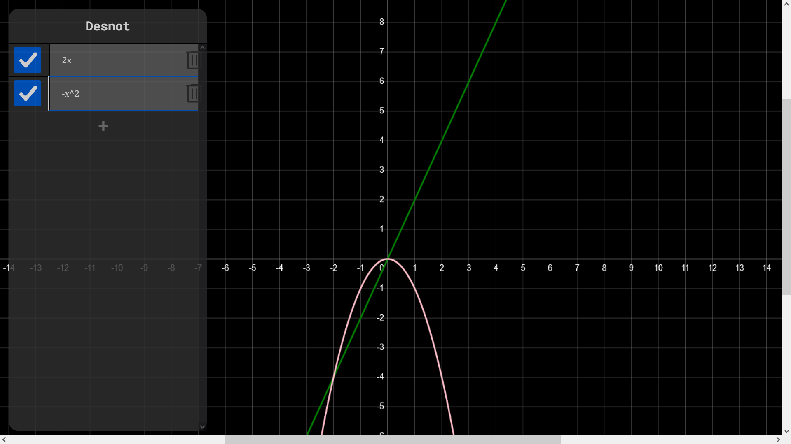

# Desnot Graphing Calculator

Hosted on [GitHub Pages](https://viggostrom.github.io/Desnot-Graphing-Calculator/).

## Description
This is a knock-off of [Desmos](https://www.desmos.com/calculator), a graphing calculator that can plot functions and relations. It is written in JavaScript and uses the HTML5 canvas element to draw the graphs.